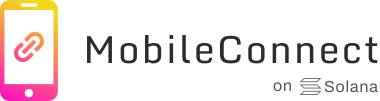

Hi!

My name is Maxim Schmidt 😁

**I'm a web3 developer, focused on Solana.**

Contact: DM me on [Twitter](https://twitter.com/maximschmidt94)

Some of my projects:

# Solana MobileConnect

MobileConnect allows you to connect your mobile wallet to a dApp running on your desktop. (Essentially, WalletConnect for Solana)

**Won a big [bounty](https://de.superteam.fun/bounties/build-login-with-mobile) that was open for >3 months**

# Grant Finder

AI-powered tool to find grants on Solana based on a natural language description

**One of the winners of [this](https://superteam.fun/bounties/build-a-grant-finder-website) bounty**

[https://solana-grant-finder.vercel.app/](https://solana-grant-finder.vercel.app/)

# Get Your SolBoard!

When you buy an expensive skateboard, you get a coupon as NFT, which you can redeem at your next purchase.

[https://getyoursolboard.xyz/](https://getyoursolboard.xyz/)
